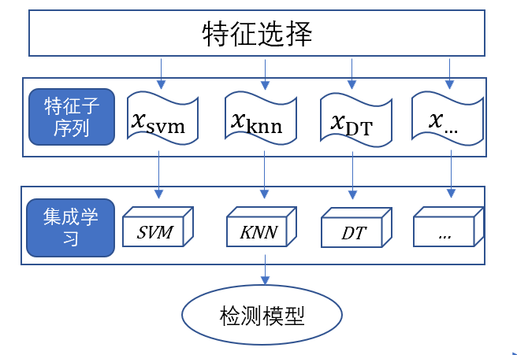

# shellDec
> A php webshell detection too based on opcode and stacking.

## Usage

主要参考了<a href="https://github.com/inspiringz/XDet"><strong>XDet</strong></a>。
在其基础上做了如下改进：

1.收集了论文<a href="https://www.sciencedirect.com/science/article/pii/S0167404821001905"><strong>Handling webshell attacks: A systematic mapping and survey</strong></a>中总结的正负样本，共2201个可用的php webshell，以及9804个正常php文件。为了保持正负样本平衡，白样本随机选了2451个用来训练。
    
    
2.用COVEC和TFIDF进行特征提取时，n_gram为1-3，选择前5000个频率最高的词组作为特征。
    
    
3.在此基础上运用了特征选择，算法未给出，结果存放在<a href="data/wd_knn_feature.csv"><strong>wd_knn_feature.csv</strong></a>选择了2400个特征，<a href="data/wd_tree_feature.csv"><strong>wd_tree_feature.csv</strong></a>选择了1604个特征，<a href="data/wd_svm_feature.csv"><strong>wd_svm_feature.csv</strong></a>选择了2197个特征。
    
    
4.用stacking进行训练，基分类器分别为knn、决策树和svm，元分类器为逻辑回归。每个基分类器分别用不同的特征进行训练。

##模型结构

##训练结果

